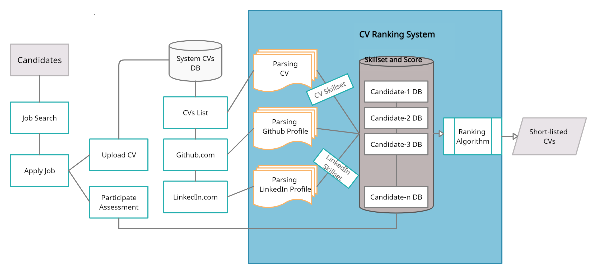
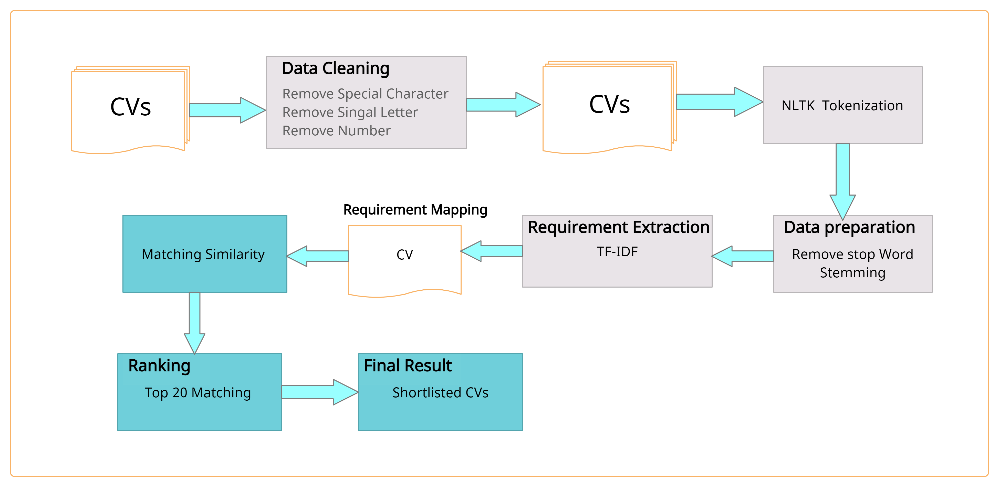
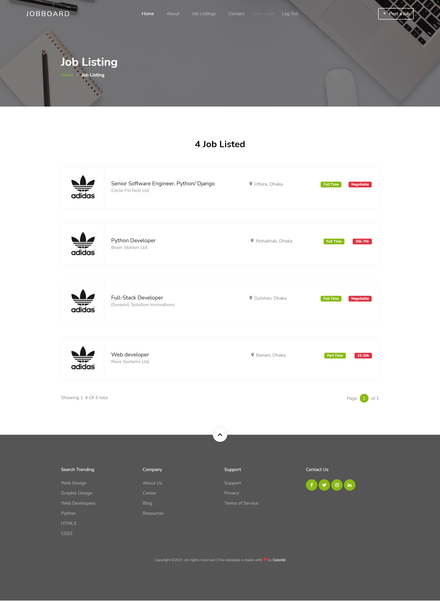
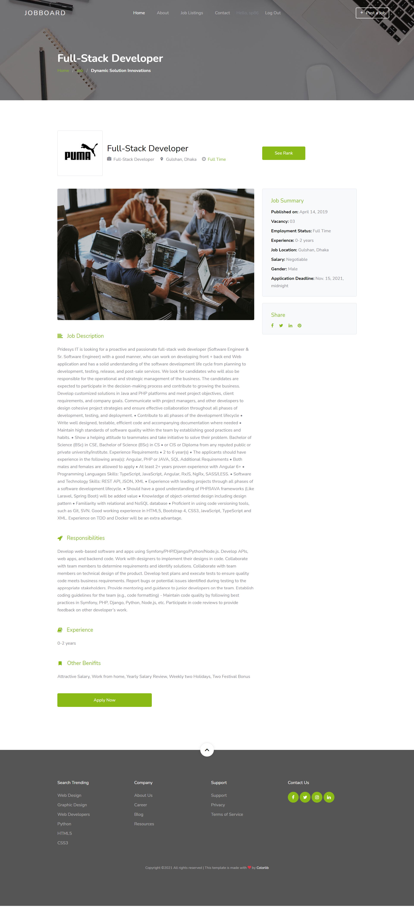
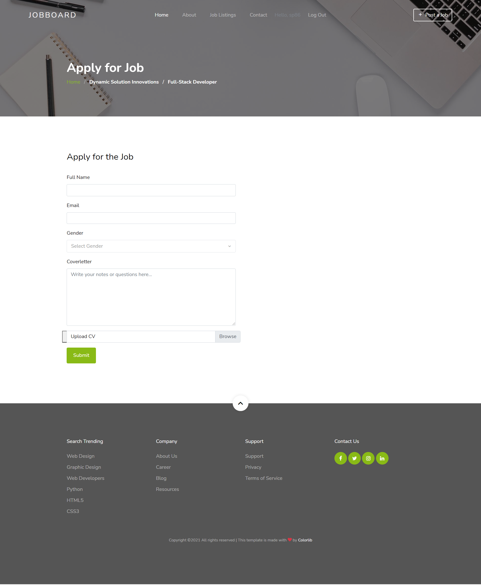
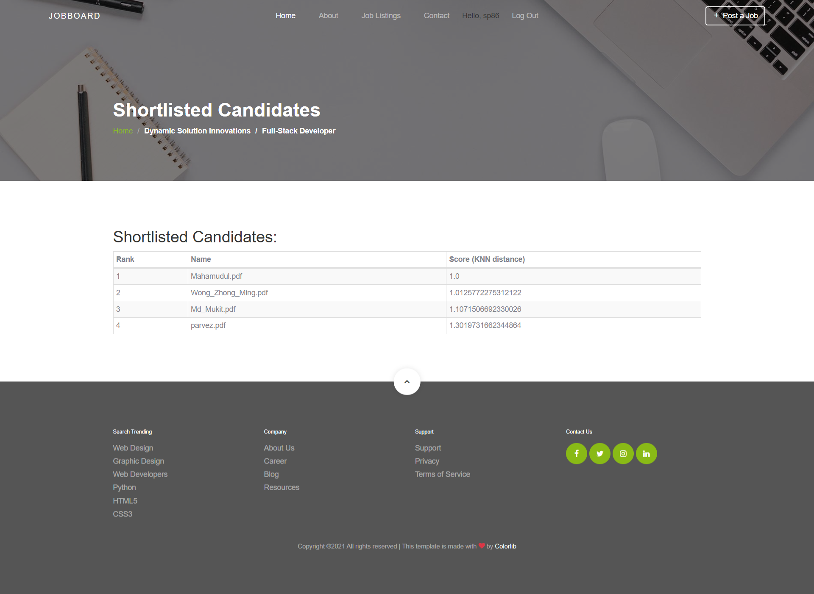
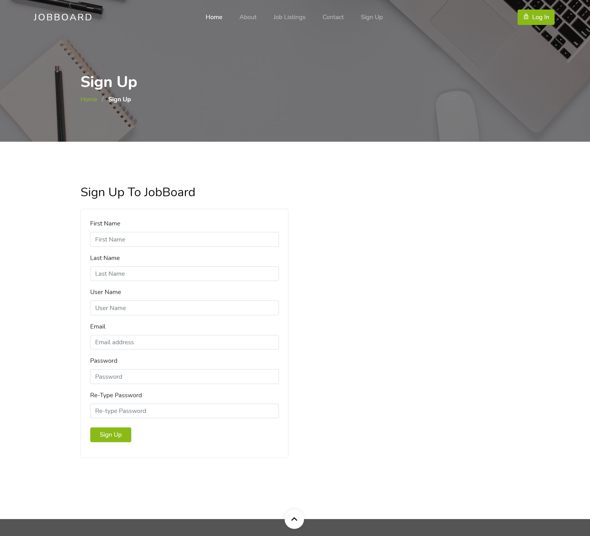

# 🎯 Smart Recruitment & Resume Ranking System

> **An ML-powered web application that automates resume screening and candidate ranking using TF-IDF and K-Nearest Neighbors.**


---

## 📋 Table of Contents

- [Overview](#-overview)
- [Objectives](#-objectives)
- [Core Features](#-core-features)
- [System Architecture](#-system-architecture)
- [Ranking Algorithm](#-ranking-algorithm)
- [Tech Stack](#-tech-stack)
- [Setup & Installation](#-setup--installation)
- [Usage](#-usage)
- [Screenshots](#-screenshots)

---

## 🔍 Overview

Finding the right candidate from hundreds of applications is one of the most time-consuming challenges facing HR teams today. Manual resume review is slow, inconsistent, and expensive.

The **Smart Recruitment and Resume Ranking System** is a Django-based web application that automates the end-to-end screening process. Recruiters post job vacancies with requirements; applicants apply and upload their CVs. The system then:

1. **Parses** CV text and optional GitHub/LinkedIn profile data
2. **Processes** that data through an NLP pipeline (tokenization, stemming, stop-word removal)
3. **Scores** each candidate using TF-IDF weighted vectors + KNN cosine similarity
4. **Ranks** applicants and surfaces the top matches to the recruiter

The result: faster, fairer, data-driven hiring decisions.

---

## 🎯 Objectives

| Goal | Description |
|---|---|
| 🏆 **Find the Best Candidates** | Identify the most qualified applicants for each vacancy automatically |
| 📊 **Realistic Ranking** | Score candidates on real skills and experience, not just keyword density |
| 🔄 **Flexible Data Sources** | Ingest CVs, GitHub profiles, and LinkedIn profiles for a complete picture |
| ⏱️ **Save Time & Cost** | Eliminate manual screening and reduce recruiter workload significantly |

---

## ✨ Core Features

### 👔 For Recruiters
- **Post Job Vacancies** — Create detailed listings with required skills, experience levels, and qualifications
- **Unified Dashboard** — Review all applications and submissions in one place
- **Automatic Ranking** — Candidates are scored and sorted by CV match and skill alignment
- **Shortlist & Invite** — Easily shortlist top-ranked candidates for interview rounds

### 👤 For Candidates / Applicants
- **Browse & Filter Jobs** — Search by location, salary, and employment type
- **Apply with CV & Cover Letter** — Submit applications directly through the platform
- **Link External Profiles** — Connect GitHub and LinkedIn profiles for a richer application
- **Take Assessments** — Participate in job-specific assessments that factor into the final score

### ⚙️ System Capabilities
- Multi-source data extraction (CV, GitHub, LinkedIn)
- Automated skill identification and job-requirement matching
- TF-IDF + KNN intelligent candidate scoring
- Filtering by CGPA, degree, and years of experience

---

## 🏗️ System Architecture

### Overall Flow

```
Candidates
    │
    ├─ Search Jobs
    ├─ Apply & Upload CV
    └─ Take Assessments
             │
             ▼
     ┌───────────────┐
     │  CVs Database │
     └───────┬───────┘
             │
             ▼
     ┌───────────────────┐
     │  CV Ranking Engine │
     │  (Parse & Analyse) │
     └───────┬───────────┘
             │
             ▼
      Shortlisted CVs  ──► Recruiter Dashboard
```



---

### CV Ranking Model Architecture

The ranking pipeline processes candidate data from three sources through a series of NLP and ML stages:

```
  Input Sources          NLP Pipeline              ML Scoring
┌──────────────┐    ┌────────────────────┐    ┌──────────────────┐
│  CV Upload   │    │ 1. Parse & Extract │    │ TF-IDF Vectors   │
│  GitHub URL  │───►│ 2. Clean Text      │───►│        +         │
│  LinkedIn URL│    │ 3. Tokenise (NLTK) │    │ KNN Cosine Sim   │
└──────────────┘    │ 4. Remove Stopwords│    └────────┬─────────┘
                    │ 5. Stem & Lemmatise│             │
                    └────────────────────┘             ▼
                                               Ranked Candidate List
                                               (Top K recommendations)
```



---

## 🧠 Ranking Algorithm

### Step 1 — Basic Requirements Filtering

Before scoring, candidates are pre-filtered against hard requirements:
- Minimum CGPA / degree qualification
- Minimum required years of experience

### Step 2 — Data Pre-processing

Raw text from CVs and profiles is cleaned and normalised:
- Remove special characters, punctuation, and numbers
- Apply **word stemming** (Porter Stemmer)
- Apply **verb lemmatisation** for consistent word forms

### Step 3 — TF-IDF Calculation

Each keyword in a resume is weighted using TF-IDF:

```
weight(keyword) = TF(keyword) × IDF(keyword)

Where:
  TF(keyword)  = frequency of the keyword in the resume
  IDF(keyword) = 1  for required skills
               = 0  for unwanted / irrelevant skills
```

This ensures the model boosts candidates who demonstrate the exact skills the role demands.

### Step 4 — KNN Similarity Matching

TF-IDF weighted vectors from each CV are compared to the job description vector using **cosine similarity** via the K-Nearest Neighbors algorithm. The closer the angle between vectors, the higher the match.

### Step 5 — Final Scoring & Ranking

```
Final Score = CV Match Score + Assessment Score
```

All candidates are ranked by their final score and the **top K candidates** (default: 20) are returned to the recruiter as recommendations.

---

## 🛠️ Tech Stack

| Layer | Technology |
|---|---|
| **Web Framework** | Django 3.2 |
| **Language** | Python 3.9 |
| **Database** | SQLite 3 |
| **ML / Similarity** | scikit-learn 1.3 (TF-IDF, KNN) |
| **NLP** | NLTK 3.8 (tokenisation, stemming, lemmatisation) |
| **PDF Parsing** | PyPDF2 3.0 |
| **Other NLP** | inflect, stop-words |

---

## 🚀 Setup & Installation

> 💡 For Windows-specific setup with Python 3.9, see **[INSTRUCTIONS.md](INSTRUCTIONS.md)**.

### Prerequisites

- Python **3.9** (required — Django 3.2 + pinned ML libs are not compatible with 3.11/3.12)
- pip
- Git

### Installation Steps

**1. Clone the repository**
```bash
git clone <repository-url>
cd Smart-Recruitment-System
```

**2. Create and activate a virtual environment**
```bash
# Windows
py -3.9 -m venv venv
.\venv\Scripts\activate

# macOS / Linux
python3.9 -m venv venv
source venv/bin/activate
```

**3. Install dependencies**
```bash
pip install -r requirements.txt
```

**4. Download NLTK data** *(one-time)*
```bash
python -c "import nltk; [nltk.download(p) for p in ['punkt','stopwords','wordnet','omw-1.4']]"
```

**5. Run database migrations**
```bash
python manage.py migrate
```

**6. Create a superuser (recruiter / admin)**
```bash
python manage.py createsuperuser
```

**7. Start the development server**
```bash
python manage.py runserver
```

The application will be available at **http://127.0.0.1:8000/**
Django Admin panel: **http://127.0.0.1:8000/admin/**

---

## 📖 Usage

### Recruiter Workflow
1. Log in with your superuser account (or any account with `is_staff=True`)
2. Post a new job vacancy with required skills and qualifications
3. Wait for candidates to apply
4. Open the ranking dashboard to view automatically scored and sorted applicants
5. Shortlist top candidates for interview

### Candidate Workflow
1. Register via the sign-up page
2. Browse job listings and filter by your preferences
3. Apply to a vacancy — upload your **text-based PDF** CV and cover letter
4. Optionally link your GitHub and LinkedIn profile URLs
5. Complete any assessments associated with the role

> ⚠️ **CV Format**: CVs must be text-based PDFs. Scanned / image-only PDFs cannot be parsed and will result in a zero-text extraction.

### User Role Reference

| Role | How to set | Permissions |
|---|---|---|
| **Recruiter** | `is_staff = True` (Django Admin or superuser) | Post jobs, view rankings, shortlist candidates |
| **Candidate** | Default (normal sign-up) | Browse jobs, apply, take assessments |

To promote an existing user to recruiter: **Django Admin → Users → select user → tick `is_staff`**

---

## 📸 Screenshots

| Homepage | Job Listings | Job Details |
|:---:|:---:|:---:|
|  |  |  |

| Apply | Ranking Results | Sign Up |
|:---:|:---:|:---:|
|  |  |  |